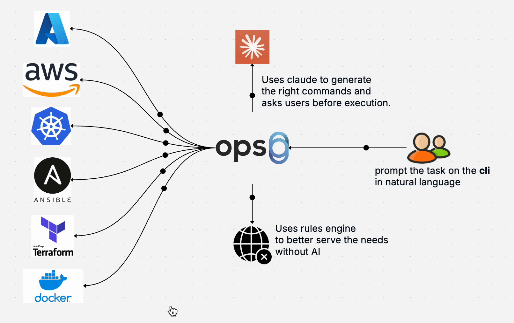
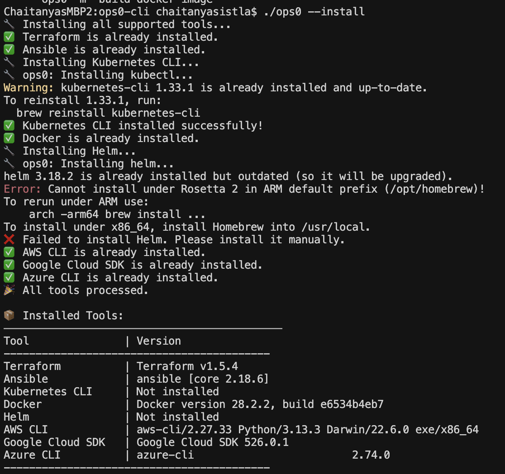
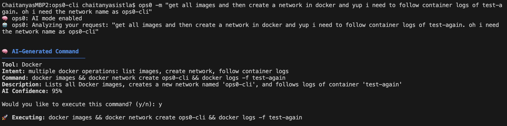
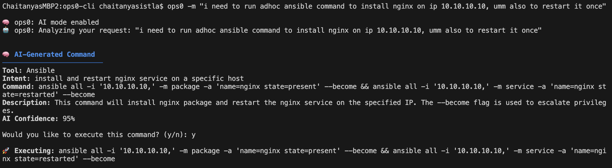
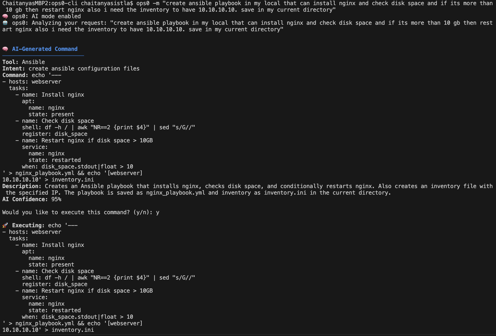
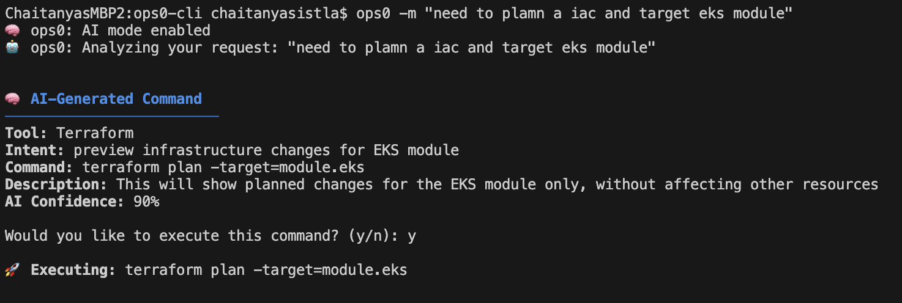
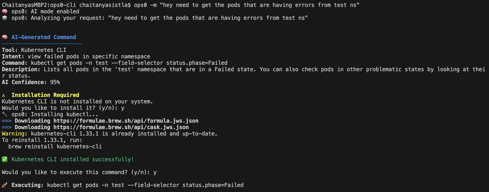

<p align="center">
  
</p>

<p align="center">
  <a href="./README.zh-CN.md">ReadMe in Chinese</a> • 
  ReadMe in German • 
  <a href="./README.fr.md">ReadMe in French</a> • 
  <a href="./README.es.md">ReadMe in Spanish</a> • 
  <a href="./README.pt-BR.md">ReadMe in Portuguese</a> • 
  <a href="https://join.slack.com/t/ops0/shared_invite/zt-37akwqb1v-BvfK7AioDlRhje94UN2tkw">Slack Community</a>
</p>

---

<p align="center">
ops0 ist ein intelligentes CLI-Tool, das natürliche Sprache in DevOps-Befehle umwandelt.<br>
Unterstützt durch Claude AI vereinfacht es komplexe DevOps-Aufgaben, indem es Ihre Absicht versteht<br>
und die richtigen Befehle generiert, wodurch DevOps-Management zugänglicher und effizienter wird.
</p>

## ops0 in Aktion


*Sehen Sie, wie ops0 natürliche Sprache in leistungsstarke DevOps-Befehle übersetzt*

## Schnellstart

### Alle Tools mit einem Befehl installieren



Sie können jetzt alle unterstützten DevOps-Tools mit nur einem Befehl installieren:

```bash
ops0 --install
```

Damit werden Terraform, Ansible, kubectl, Docker, Helm, AWS CLI, gcloud und Azure CLI automatisch installiert und deren Versionen in einer Übersichtstabelle angezeigt.

### Installation
```bash
curl -fsSL https://raw.githubusercontent.com/ops0-ai/ops0-cli/main/install.sh | bash
```

### Grundlegende Verwendung
```bash
# Regelbasierter Modus (kein API-Schlüssel erforderlich)
ops0 -m "i want to plan my iac code"

# KI-gestützter Modus (API-Schlüssel erforderlich)
export ANTHROPIC_API_KEY=your_key_here
ops0 -m "check if my kubernetes pods are running" -ai

# Fehlerbehebungsmodus
ops0 -m "my terraform apply is failing with state lock" -troubleshoot
```

## Befehlsbeispiele in Aktion

Hier sind einige reale Beispiele von ops0 in verschiedenen Tools:

### AWS CLI-Operationen

*Beispiel: Verwaltung von AWS-Ressourcen mit natürlichsprachlichen Befehlen*

### Docker-Container-Verwaltung

*Beispiel: Verwaltung von Docker-Containern und Images mit einfacher Sprache*

### Ansible-Automatisierung


*Beispiel: Mühelose Ausführung und Validierung von Ansible-Playbooks*

### Terraform-Infrastruktur

*Beispiel: Verwaltung von Infrastruktur als Code mit natürlicher Sprache*

### Kubernetes-Operationen

*Beispiel: Vereinfachtes Kubernetes-Cluster-Management und Fehlerbehebung*

## Unterstützte Tools & Funktionen

### Kernwerkzeuge
- **Terraform** - Infrastructure as Code
- **Ansible** - Konfigurationsmanagement
- **Kubernetes (kubectl)** - Container-Orchestrierung
- **Docker** - Containerisierung
- **AWS CLI** - Amazon Web Services
- **Helm** - Kubernetes-Paketmanager
- **gcloud** - Google Cloud Platform
- **Azure CLI** - Microsoft Azure
- **System Admin** - Linux-Systemverwaltung

### Systemverwaltungsbeispiele
```bash
# Systemressourcen überwachen
ops0 -m "Speichernutzung auf meinem Computer anzeigen"
ops0 -m "Festplattenspeicher prüfen"
ops0 -m "CPU-Auslastung anzeigen"

# Systemdienste verwalten
ops0 -m "nginx-Dienst neu starten"
ops0 -m "apache2-Dienststatus prüfen"

# Paketverwaltung
ops0 -m "docker-Paket installieren"
ops0 -m "Systempakete aktualisieren"

# Systemprotokolle
ops0 -m "Systemprotokolle anzeigen"
ops0 -m "Journalprotokolle prüfen"
```

### Systemverwaltung & Log-Analyse Beispiele
```bash
# Kubernetes Pod-Logs analysieren und KI-Zusammenfassung mit Empfehlungen erhalten
ops0 -m "analysiere logs für pod my-app-123 im namespace prod"

# Eine bestimmte Logdatei auf Probleme analysieren
ops0 -m "analysiere /var/log/nginx/error.log"
```

### Hauptfunktionen
- Übersetzung natürlicher Sprache
- KI-gestützte Fehlerbehebung
- **Kubernetes Pod-Log-Analyse mit KI-Zusammenfassung und Befehlsvorschlägen**
- **Logdateipfad-Analyse für Probleme und Kontext**
- Kontextbewusste Vorschläge
- Sichere Ausführung mit Bestätigung
- Dry-Run-Unterstützung für destruktive Operationen
- Automatische Tool-Installation

## KI vs. Regelbasierter Modus

| Funktion | Regelbasiert | KI-Modus |
|---------|------------|---------|
| Einrichtung | Kein API-Schlüssel benötigt | Benötigt ANTHROPIC_API_KEY |
| Geschwindigkeit | Sofort | ~2-3 Sekunden |
| Verständnis | Mustererkennung | Natürliche Sprache |
| Kontextbewusstsein | Begrenzt | Hoch |
| Fehlerbehebung | Grundlegend | Fortgeschritten |
| Komplexe Szenarien | Begrenzt | Ausgezeichnet |
| Offline-Nutzung | ✅ | ❌ |

## Konfiguration

### Umgebungsvariablen
```bash
# Erforderlich für KI-Funktionen
export ANTHROPIC_API_KEY=your_api_key

# Optional: KI-Verhalten anpassen
export OPS0_AI_MODEL=claude-3-sonnet-20240229  # Standardmodell
export OPS0_MAX_TOKENS=1024                    # Antwortlänge
```

## Datenschutz & Sicherheit

- **API-Schlüssel**: Lokal als Umgebungsvariable gespeichert
- **Keine Datenspeicherung**: Befehle und Kontext werden nicht von ops0 gespeichert
- **Anthropic-Datenschutz**: Folgt Anthropics Datenverarbeitungsrichtlinien
- **Lokale Verarbeitung**: Regelbasierter Modus arbeitet vollständig offline

## Roadmap

### Aktuell
- [x] Claude AI-Integration
- [x] Grundlegender Fehlerbehebungsmodus
- [x] Kontextbewusstsein
- [x] Multi-Tool-Unterstützung

### Demnächst
- [ ] Angepasstes Modell für Offline-Umgebungen
- [ ] Interaktive mehrstufige Workflows
- [ ] Lernen aus Benutzer-Feedback
- [ ] Benutzerdefinierte Tool-Konfigurationen
- [ ] Unterstützung mehrerer KI-Anbieter
- [ ] Erweiterte Kontextanalyse
- [ ] Team-Kollaborationsfunktionen

## Tipps

1. **Seien Sie spezifisch**: "Mein Terraform-Plan zeigt 5 Ressourcenänderungen" vs. "Terraform-Fehler"
2. **Nutzen Sie den Fehlerbehebungsmodus**: Für komplexe Probleme verwenden Sie die `-troubleshoot`-Flag
3. **Prüfen Sie den Kontext**: KI funktioniert besser im richtigen Verzeichnis
4. **Überprüfen Sie Befehle**: Prüfen Sie immer KI-Vorschläge vor der Bestätigung
5. **Geben Sie Feedback**: Nutzen Sie GitHub Issues für KI-Genauigkeitsprobleme 