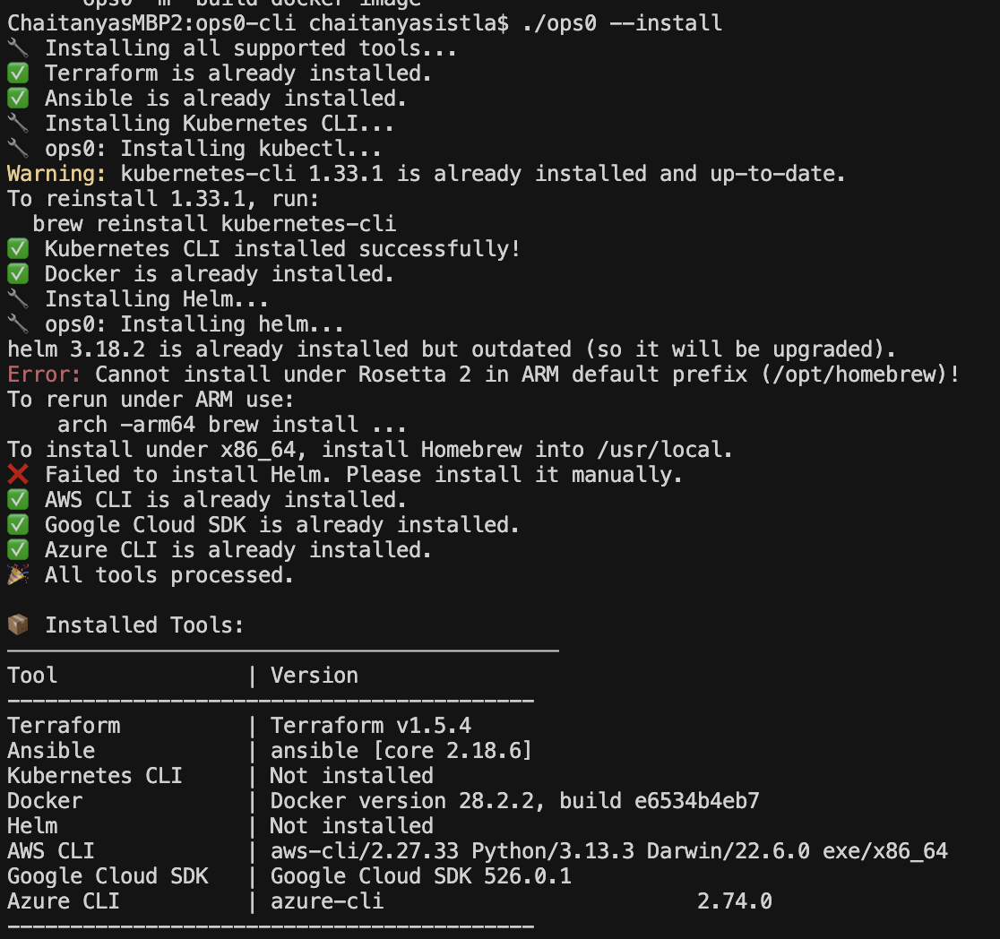

<p align="center">
  
</p>

<p align="center">
  ReadMe in Chinese • 
  <a href="./README.de.md">ReadMe in German</a> • 
  <a href="./README.fr.md">ReadMe in French</a> • 
  <a href="./README.es.md">ReadMe in Spanish</a> • 
  <a href="./README.pt-BR.md">ReadMe in Portuguese</a> • 
  <a href="https://join.slack.com/t/ops0/shared_invite/zt-37akwqb1v-BvfK7AioDlRhje94UN2tkw">Slack Community</a>
</p>

<p align="center">
  <a href="https://github.com/ops0-ai/ops0-cli/commits/main"></a>
  <a href="https://github.com/ops0-ai/ops0-cli/releases"></a>
  <a href="https://github.com/ops0-ai/ops0-cli/stargazers"></a>
</p>

---

<p align="center">
ops0 是一个智能命令行工具，可以将自然语言转换为 DevOps 操作。<br>
由 Claude AI 提供支持，它通过理解您的意图来简化复杂的 DevOps 任务，<br>
执行正确的操作，使 DevOps 管理更加便捷高效。
</p>

## ops0 演示


*观看 ops0 如何将自然语言转换为强大的 DevOps 操作*

### 安装
```bash
curl -fsSL https://raw.githubusercontent.com/ops0-ai/ops0-cli/main/install.sh | bash
```

### 基本用法
```bash
# 规则模式 (无需 API 密钥)
ops0 -m "我想规划我的基础设施代码"

# AI 支持模式 (需要 API 密钥)
export ANTHROPIC_API_KEY=your_key_here
ops0 -m "检查我的 kubernetes pods 是否在运行" -ai

# 故障排除模式
ops0 -m "我的 terraform apply 因 state lock 失败" -troubleshoot

# 交互式操作模式
ops0 -o
```

*使用 `ops0 -o` 进入交互式操作模式：输入自然语言请求，连续执行多项操作，直到输入 'quit' 或 'exit' 结束会话。*

## 操作演示

以下是 ops0 在不同工具中的实际应用示例：

### Kafka 管理员模式
[](https://www.loom.com/share/c800f1f15865489780586c9d154ef365?sid=0e17ade7-6035-4eea-853a-c0e924ec4715)

*示例：使用自然语言交互式管理 Kafka 集群。*

### AWS CLI 操作

*示例：使用自然语言命令管理 AWS 资源*

### Docker 容器管理

*示例：使用简单的中文管理 Docker 容器和镜像*

### Ansible 自动化


*示例：轻松执行和验证 Ansible playbook*

### Terraform 基础设施

*示例：使用自然语言管理基础设施即代码*

### Kubernetes 操作

*示例：简化的 Kubernetes 集群管理和故障排除*

### 一键安装所有工具



现在，您可以通过一条命令安装所有支持的 DevOps 工具：

```bash
ops0 --install
```

该命令会自动安装 Terraform、Ansible、kubectl、Docker、Helm、AWS CLI、gcloud 和 Azure CLI，并在最后以表格形式显示所有工具的版本。

## 支持的工具和功能

### 核心工具
- **Terraform** - 基础设施即代码
- **Ansible** - 配置管理
- **Kubernetes (kubectl)** - 容器编排
- **Docker** - 容器化
- **AWS CLI** - 亚马逊云服务
- **Helm** - Kubernetes 包管理器
- **gcloud** - 谷歌云平台
- **Azure CLI** - 微软 Azure
- **System Admin** - Linux 系统管理

### 系统管理示例
```bash
# 监控系统资源
ops0 -m "显示我的机器内存使用情况"
ops0 -m "检查磁盘空间"
ops0 -m "显示 CPU 使用率"

# 管理系统服务
ops0 -m "重启 nginx 服务"
ops0 -m "检查 apache2 服务状态"

# 包管理
ops0 -m "安装 docker 包"
ops0 -m "更新系统包"

# 系统日志
ops0 -m "显示系统日志"
ops0 -m "检查日志记录"
```

### 系统管理与日志分析示例
```bash
# 分析 Kubernetes Pod 日志并获得 AI 总结和建议
ops0 -m "分析 pod my-app-123 在 prod 命名空间的日志"

# 分析指定日志文件中的问题
ops0 -m "分析 /var/log/nginx/error.log"
```

### 主要功能
- 自然语言命令转换
- AI 驱动的故障排除
- **Kubernetes Pod 日志分析，AI 总结与命令建议**
- **日志文件路径分析，自动发现问题并提供上下文**
- 上下文感知建议
- 安全执行确认
- 破坏性操作的预演支持
- 自动工具安装

## AI 模式与规则模式对比

| 功能 | 规则模式 | AI 模式 |
|---------|------------|---------|
| 设置 | 无需 API 密钥 | 需要 ANTHROPIC_API_KEY |
| 速度 | 即时 | 约 2-3 秒 |
| 理解能力 | 模式匹配 | 自然语言 |
| 上下文感知 | 有限 | 高 |
| 故障排除 | 基础 | 高级 |
| 复杂场景 | 有限 | 优秀 |
| 离线使用 | ✅ | ❌ |

## 配置

### 环境变量
```bash
# AI 功能必需
export ANTHROPIC_API_KEY=your_api_key

# 可选：自定义 AI 行为
export OPS0_AI_MODEL=claude-3-sonnet-20240229  # 默认模型
export OPS0_MAX_TOKENS=1024                    # 响应长度
```

## 隐私与安全

- **API 密钥**：本地存储为环境变量
- **无数据存储**：ops0 不存储命令和上下文
- **Anthropic 隐私**：遵循 Anthropic 的数据处理政策
- **本地处理**：规则模式完全离线工作

## 路线图

### 当前
- [x] Claude AI 集成
- [x] 基础故障排除模式
- [x] 上下文感知
- [x] 多工具支持

### 即将推出
- [ ] 支持离线环境的自定义模型
- [ ] 交互式多步工作流
- [ ] 从用户反馈中学习
- [ ] 自定义工具配置
- [ ] 多 AI 提供商支持
- [ ] 高级上下文分析
- [ ] 团队协作功能

## 使用技巧

1. **具体描述**：使用"我的 terraform plan 显示 5 个资源更改"而不是"terraform 错误"
2. **使用故障排除模式**：对于复杂问题，使用 `-troubleshoot` 标志
3. **检查上下文**：在正确的目录中使用 AI 效果更好
4. **检查命令**：在确认之前始终检查 AI 建议
5. **提供反馈**：使用 GitHub issues 报告 AI 准确性问题 